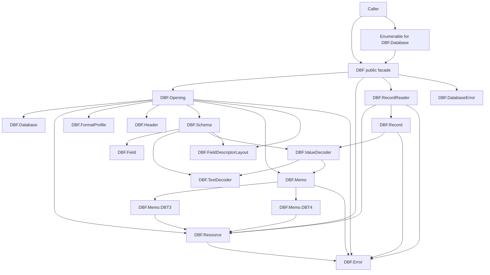
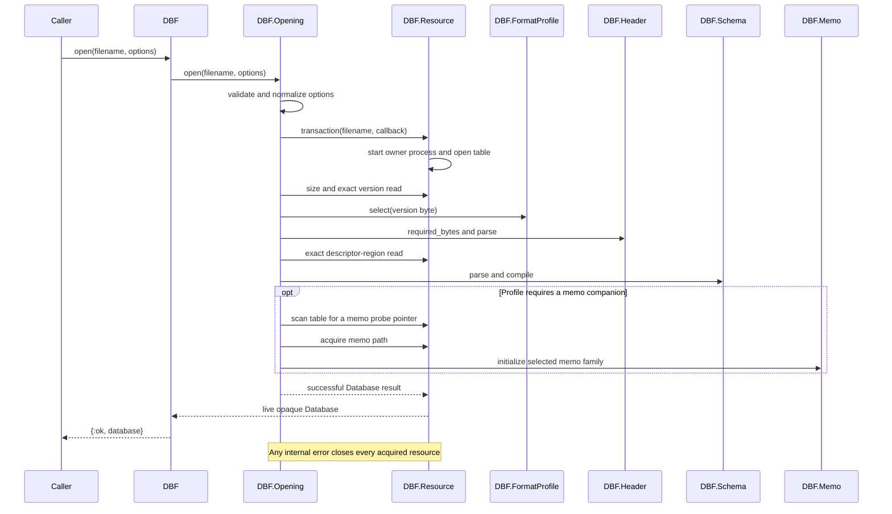
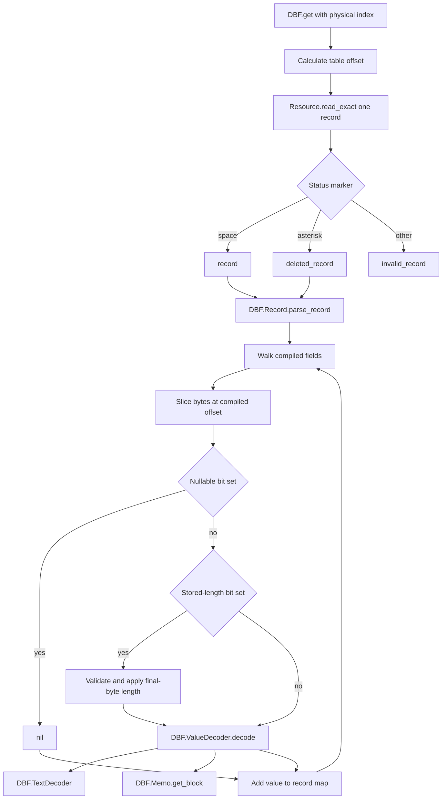

# DBFex architecture

This document explains how DBFex reads DBF tables, how its modules collaborate,
and which invariants hold the implementation together. It describes the current
reader after Phases -1 through 3 and the first partial Phase 4 FoxPro and Visual
FoxPro slices. The evidenced `0x31` null and `0x32` variable-width metadata is
implemented; broader Visual FoxPro support is called out separately and must
not be mistaken for implemented behavior.

For byte-level format notes and source references, see [`DBF-Format.md`](DBF-Format.md).
For the decisions behind this architecture, see [`docs/adr/`](https://github.com/JonGretar/DBFex/tree/main/docs/adr).

## Mental model

DBFex is a read-only, lazy, positional table reader:

1. **Opening compiles the table.** DBFex validates options, opens resources,
   selects a format profile, parses the header and schema, compiles field and
   text decoders, and validates any required memo companion.
2. **The returned database is an opaque live handle.** It contains compiled
   metadata and a process-backed resource owner, not loaded record data.
3. **Records are read on demand.** `DBF.get/2` and `Enumerable` delegate to the
   physical record reader for an exact positional read of one record.
4. **Compiled metadata drives decoding.** Record reads use field offsets and
   decoder tags selected during opening rather than rediscovering format rules.
5. **The public seam is narrow.** Internal modules return `%DBF.Error{}`; `DBF`
   translates errors into the stable tagged-tuple interface with
   `%DBF.DatabaseError{}`.

DBFex does not load an entire table into memory, keep a shared file cursor, infer
formats from extensions, or expose parser modules as supported public APIs.

## Architecture at a glance



The important split is between **orchestration**, **bounded parsing/decoding**,
and **resource ownership**:

- `DBF.Opening` orchestrates a transactional open.
- `DBF.RecordReader` owns physical record access and record-level context.
- `DBF.Header`, `DBF.Schema`, `DBF.Record`, `DBF.ValueDecoder`, and
  `DBF.TextDecoder` interpret bounded bytes.
- `DBF.Resource` alone owns file devices and performs positional reads.
- `DBF` presents the supported public interface and translates errors.

Memo implementations perform their own positional reads because memo values may
span blocks and are loaded lazily during record decoding. They still access
files only through `DBF.Resource`.

## Public compatibility perimeter

The stable pre-1.0 interface is intentionally small:

- `DBF.open/1,2`
- `DBF.open!/1,2`
- `DBF.with_open/2,3`
- `DBF.get/2`
- `DBF.close/1`
- `Enumerable` for databases returned by `DBF.open/1,2`
- Record results shaped as:

  ```elixir
  {:record, map}
  {:deleted_record, map}
  {:error, %DBF.DatabaseError{}}
  ```

Although `%DBF.Database{}`, `%DBF.Field{}`, and `%DBF.Memo{}` are technically
observable structs, they are intentionally unstable implementation details. An
open `%DBF.Database{}` should be treated as an opaque handle: callers may pass it
to `DBF` and `Enum` functions but should not construct, copy, update, or
pattern-match on its fields.

The broad `DBF.DatabaseError.reason` category is the stable part of an error.
Its `cause`, context fields, and formatted message may become more detailed.

See [ADR 0001](https://github.com/JonGretar/DBFex/blob/main/docs/adr/0001-compatibility-perimeter.md) for the exact compatibility
classification.

## Opening a database

`DBF.open/2` is deliberately a thin public facade. The complete opening
operation lives behind `DBF.Opening.open/2`.



### Opening stages

1. **Validate options before file access.** Unknown names, invalid containers,
   and invalid values return `:invalid_options` even if the filename is missing.
2. **Start a resource transaction.** `DBF.Resource` starts a process and opens the
   table in raw, binary, read-only mode.
3. **Read the version byte and select a profile.** Selection occurs once in
   `DBF.FormatProfile`.
4. **Parse the header.** `DBF.Header` validates the selected layout, version,
   date, declared lengths, record count, and file bounds.
5. **Read and compile the schema.** `DBF.Schema` validates field descriptors and
   compiles record offsets, value decoders, and one table text decoder.
6. **Initialize a memo companion when required.** Opening finds the first
   nonblank memo pointer as a format probe, tries an explicit path or the
   adjacent `.dbt`/`.DBT` paths, acquires the file, and validates the selected
   memo family.
7. **Construct the open database.** A successful transaction leaves the resource
   process alive and returns `%DBF.Database{}`. A failed transaction closes the
   table and any acquired memo file.
8. **Translate public errors.** `DBF` converts `%DBF.Error{}` into
   `%DBF.DatabaseError{}`.

### Opening options

`DBF.Opening` owns defaults and validation for:

| Option             | Values                                            | Default  | Purpose                                            |
| ------------------ | ------------------------------------------------- | -------- | -------------------------------------------------- |
| `:memo_file`       | path or `nil`                                     | `nil`    | Explicit companion path or adjacent-file discovery |
| `:numeric`         | `:float`, `:exact`                                | `:float` | Compatible floats or integers/`Decimal` values     |
| `:encoding`        | `:auto`, `:raw`, `:windows_1251`, `:windows_1252` | `:auto`  | Source encoding selection                          |
| `:encoding_errors` | `:strict`, `:replace`, `:raw`                     | `:raw`   | Undefined-byte and unresolved-driver policy        |

The distinction between option validation and profile validation matters. A
well-typed explicit memo path is valid input, but it is rejected later if the
selected profile does not support memo files.

## Format profiles: select once, dispatch by capability

`DBF.FormatProfile` is the single format-selection point. The current
implementation selects by version byte, then represents the chosen format as a
composition of independent axes:

- header layout;
- field-descriptor layout;
- memo family;
- memo requirement;
- record layout;
- supported field kinds.

Parsers dispatch on those profile values instead of scattering raw version-byte
checks throughout the codebase. This allows related formats to share real
layout algorithms without pretending that every aspect of a named format is the
same.

Current profiles are:

| Version | Label               | Header               | Descriptor           | Memo    | Supported field kinds                       |
| ------- | ------------------- | -------------------- | -------------------- | ------- | ------------------------------------------- |
| `0x02`  | FoxBase             | `:foxbase_8`         | `:foxbase_16`        | none    | character, unscaled numeric                 |
| `0x03`  | dBASE III           | `:dbase_legacy_32`   | `:dbase_legacy_32`   | none    | character, numeric, float, logical, date    |
| `0x30`  | Visual FoxPro       | `:visual_foxpro_32` | `:visual_foxpro_32` | optional FPT | legacy kinds, integer, timestamp, text memo, type-0 Picture payload |
| `0x83`  | dBASE III with memo | `:dbase_legacy_32`   | `:dbase_legacy_32`   | DBT III | legacy kinds plus text memo                 |
| `0x8B`  | dBASE IV with memo  | `:dbase_legacy_32`   | `:dbase_legacy_32`   | DBT IV  | legacy kinds plus text memo                 |
| `0xF5`  | FoxPro 2.x          | `:dbase_legacy_32`   | `:dbase_legacy_32`   | FPT     | legacy kinds plus text memo                 |

A recognized one-byte field type is not enough to enable decoding. The selected
profile must explicitly advertise that field kind. Unsupported capabilities are
kept unsupported rather than borrowing semantics from another xBase variant.

See [ADR 0003](https://github.com/JonGretar/DBFex/blob/main/docs/adr/0003-compose-format-variants-by-layout.md).

## Header and schema compilation

### `DBF.Header`

`DBF.Header.required_bytes/1` tells opening how many bytes the selected header
layout needs. `parse/3` converts those bounded bytes into validated structural
metadata:

- version;
- last-updated date;
- physical record count;
- header length;
- record length;
- table flags where present;
- language-driver byte where present.

It also proves that the declared header and all declared fixed-width records fit
within the table size cached by `DBF.Resource`.

### `DBF.Schema`

Schema parsing consumes the descriptor region ending at the header boundary. It:

1. Compiles one `DBF.TextDecoder` from the language driver and options.
2. Parses descriptors using the selected descriptor layout.
3. Requires the `0x0D` descriptor terminator.
4. Validates the 263-byte Visual FoxPro backlink area when applicable.
5. Decodes field names before duplicate-name validation.
6. Rejects duplicate caller-visible field names.
7. Rejects zero-width fields and unsupported Visual FoxPro field flags or
   autoincrement metadata.
8. Verifies that `1 + sum(field widths)` equals the declared record length. The
   extra byte is the deletion/status marker.
9. Assigns each field a sequential `record_offset` beginning at byte `1`.
10. For Visual FoxPro record metadata, compiles variable-length and nullable
    bit indexes plus the `_NullFlags` location while removing that system field
    from the visible schema.
11. Compiles a decoder tag for each visible field through
    `DBF.ValueDecoder.compile/3`.

The result is `%DBF.Schema{fields, record_length, text_decoder, record_bitmap}`.
Each `%DBF.Field{}` preserves descriptor metadata and raw descriptor bytes while
also carrying its compiled offset, record-metadata bits when applicable, and
decoder.
Autoincrement fields retain their next value and step rather than classifying
those descriptor bytes as reserved.

This makes opening the structural validation and compilation point. Record reads
consume compiled metadata and do not reinterpret descriptors.

## Runtime database state

A successful open returns `%DBF.Database{}`. Its current fields combine:

- **Lifecycle:** resource, table filename, initialized memo metadata.
- **Format choice:** profile, version, validated options.
- **Header projections:** update date, record count, header bytes, record bytes,
  flags, language driver.
- **Compiled schema:** schema, fields, text decoder.

Some values are currently duplicated from parsed header and schema structures.
The compiled record bitmap nevertheless has one owner in `DBF.Schema`.
Removing observable projections such as `fields` is deferred until a stable
public metadata interface can replace them coherently. Callers must not use
struct fields as a metadata API.

No records or memo payloads are stored in the database value. Both are read
lazily.

## Random access and enumeration

### Random access with `DBF.get/2`

Record indexes are zero-based **physical** indexes. Deleted records count toward
the index and record count.

For a valid index, the table offset is:

```text
header_bytes + record_number * record_bytes
```

`DBF.RecordReader.fetch/2` requests exactly `record_bytes` from `DBF.Resource`
and interprets the first byte:

- space (`0x20`) produces `{:record, map}`;
- `*` (`0x2A`) produces `{:deleted_record, map}`;
- any other byte produces `:invalid_record`.

The marker is removed before passing the remaining bytes to
`DBF.Record.parse_record/2`.

Negative, non-integer, and out-of-range indexes return
`:invalid_record_index`. A short positional read becomes `:invalid_record`; DBFex
never returns a partial row.

### Enumeration

`Enumerable` repeatedly calls `DBF.get/2` from zero through the declared physical
record count:

- active and deleted records are emitted in file order;
- `count/1` returns the declared physical count without reading records;
- a record error is emitted as the final element, then enumeration stops;
- halt and suspension follow the `Enumerable` protocol;
- suspended enumeration retains the live database resource;
- `slice/1` and `member?/2` use protocol fallback rather than optimized readers.

Cursor state belongs to the reducer continuation, not `%DBF.Database{}`. Multiple
reads therefore do not mutate a database position.

## Record and value decoding



`DBF.Record` decodes a bounded record body and does not perform the positional
table read itself. It validates body width, walks fields in declaration order,
slices each fixed-width binary using compiled offsets, applies any compiled null
bit, then any stored variable length, before value decoding, and stops at the
first error. Memo fields may still trigger lazy memo reads through
`DBF.ValueDecoder`.
`DBF.Record` adds field name, type, and offset context; `DBF.RecordReader` adds
record number, table offset, and version context. `DBF.get/2` only translates
the resulting internal error into the public error type.

`DBF.Record` also provides a defensive seam around decoder defects. A raised
`DBF.DatabaseError`, another exception, a throw, or an exit is converted into an
internal contextual error rather than escaping as an unrelated crash. Ordinary
value parsing is expected to return values or explicit error tuples and should
not rely on that defensive catch for control flow.

### Compiled value decoders

`DBF.ValueDecoder.compile/3` turns the profile-approved field kind and numeric
option into a decoder tag stored on the field. `decode/3` dispatches on that tag:

| Kind                           | Decoding behavior                                                                                        |
| ------------------------------ | -------------------------------------------------------------------------------------------------------- |
| Character                      | Trim source-byte spaces on both sides, then apply the table text decoder                                 |
| Float (`F`)                    | Parse a float; blank is `nil`; malformed nonblank input is `:invalid_record`                             |
| Numeric, default               | Parse a float; blank or malformed input is `nil` for compatibility                                       |
| Numeric, exact                 | Scale zero becomes an integer; positive scale becomes `Decimal`; blank or malformed input is `nil`       |
| FoxBase unscaled exact numeric | Parse integer text as an integer and decimal text as `Decimal`                                           |
| Logical                        | `Y/y/T/t` is `true`; `N/n/F/f` is `false`; `?` or space is `nil`; otherwise error                        |
| Date                           | Eight spaces is `nil`; otherwise parse `YYYYMMDD` into `Date` or return an error                         |
| Text memo                      | Parse a decimal block pointer, read memo bytes lazily, then apply the table text decoder; blank is `nil` |
| Visual FoxPro integer          | Decode a signed little-endian 32-bit integer                                                            |
| Visual FoxPro currency         | Decode a signed little-endian 64-bit integer with fixed scale four as exact `Decimal`                    |
| Visual FoxPro timestamp        | Decode little-endian Julian day and milliseconds into `NaiveDateTime`; all-zero is `nil`                 |
| Visual FoxPro text memo        | Decode a little-endian 32-bit FPT pointer, then read and text-decode its declared payload                |
| Visual FoxPro Picture          | Decode a little-endian 32-bit FPT pointer and return its type-0 binary payload unchanged                 |
| Visual FoxPro Varchar          | Apply the stored byte length, then decode text without fixed-width trimming                              |
| Visual FoxPro binary `V`       | Apply the stored byte length and return the resulting binary unchanged                                  |
| Unsupported                    | Return `:unsupported_field_type` when the record is read                                                 |

For legacy profiles, `nil` represents a format-specific blank value, not an
explicit database null. Visual FoxPro `0x31` and `0x32` also return `nil` for an
explicit bitmap null, but apply that metadata before stored lengths and physical
field decoding. See [ADR 0004](https://github.com/JonGretar/DBFex/blob/main/docs/adr/0004-preserve-compatible-legacy-value-defaults.md),
[ADR 0006](https://github.com/JonGretar/DBFex/blob/main/docs/adr/0006-use-exact-currency-and-profile-aware-nulls.md),
and [ADR 0007](https://github.com/JonGretar/DBFex/blob/main/docs/adr/0007-compile-variable-field-bits-into-schema.md).

## Text decoding

One `%DBF.TextDecoder{}` is compiled during schema parsing and reused for:

- field names;
- character values;
- textual DBT and FPT memo payloads.

Numeric and structural bytes do not pass through text conversion. Padding is
removed from source bytes before code-page conversion.

`:auto` currently maps:

| Language driver        | Encoding     |
| ---------------------- | ------------ |
| `0xC9`                 | Windows-1251 |
| `0x03`, `0x57`         | Windows-1252 |
| missing, zero, unknown | unresolved   |

When a driver cannot be resolved, the compatible `encoding_errors: :raw` policy
compiles a byte-preserving decoder. Strict or replacement mode cannot convert an
unknown source encoding and therefore fails opening.

For an undefined byte in a known code page:

- `:strict` returns a contextual `:invalid_encoding` error;
- `:replace` inserts Unicode replacement character `U+FFFD`;
- `:raw` returns the complete trimmed original byte string, avoiding a binary
  containing a mixture of converted UTF-8 and source-code-page bytes.

See [ADR 0005](https://github.com/JonGretar/DBFex/blob/main/docs/adr/0005-use-explicit-text-encoding-policies.md).

## Memo architecture

Memo support is selected by `FormatProfile.memo_family`, not by extension.
`DBF.Memo` is the small dispatch facade and `%DBF.Memo{}` stores initialized
family and block-size metadata.

Memo-required profiles require a usable companion during opening. Visual FoxPro
uses its table flags to make FPT acquisition conditional. An explicit
`:memo_file` path is tried alone; otherwise DBFex tries the table root with the
lower- and uppercase extension appropriate to the selected family: `.dbt` and
`.DBT`, or `.fpt` and `.FPT`. The extension locates a candidate—it does not
determine which algorithm parses it.

Opening scans memo fields across physical records for the first nonblank block
pointer. That probe provides evidence for family validation. A table with only
blank memo pointers still requires a structurally valid companion.

### DBT III

`DBF.Memo.DBT3` implements:

- fixed 512-byte blocks;
- little-endian `next_block` header validation against memo file size;
- block pointers of at least one and within file bounds;
- payload reads across as many blocks as needed;
- `0x1A 0x1A` termination, including a terminator split across read chunks;
- rejection of EOF before the terminator;
- probe-based rejection of a detectable DBT IV companion.

### DBT IV

`DBF.Memo.DBT4` implements:

- a 512-byte header;
- declared block size, with zero normalized to 512;
- block sizes that are multiples of 512;
- header and file-size consistency checks;
- per-block `FF FF 08 00` signature validation;
- little-endian declared total block length;
- payload bounds validation;
- first `0x1F` or `0x1A` text termination;
- ASCII-whitespace trimming before the shared table text decoder is applied by
  `DBF.ValueDecoder`.

### FPT

`DBF.Memo.FPT` implements the evidenced FoxPro and Visual FoxPro memo layouts:

- a 512-byte header;
- big-endian next-block and block-size values;
- header and file-size consistency checks;
- big-endian block type and payload length values;
- type `1` text payloads and type `0` binary Picture payloads;
- exact declared-length payload reads spanning physical blocks;
- rejection of out-of-range pointers, truncated payloads, unsupported block
  types, and field/block type mismatches.

Memo payloads are not cached. Reading a memo field performs positional reads
through the same resource owner as the table.

## Resource ownership and lifecycle

`DBF.Resource` is a `GenServer` and the sole owner of open file devices. Its
opaque handle contains the server PID and a capability token.

It provides:

- `transaction/2` for opening and rollback;
- `acquire_memo/2` for at most one companion;
- `read_exact/4` using positional `:file.pread`;
- cached `size/2` and `path/2` metadata;
- `open?/1` for lifecycle checks;
- idempotent `close/1`.

Positional reads do not mutate a shared cursor. The resource process serializes
requests and preserves one logical ownership identity even if immutable database
values are copied inside the owning process.

The process that opens the database is its semantic owner. Cross-process use is
unsupported. `DBF.Resource` monitors the owner and performs best-effort cleanup
if it dies.

### Lifecycle choices

- `DBF.open/1,2` and `DBF.open!/1,2` transfer responsibility for closing the
  returned database to the caller.
- `DBF.with_open/2,3` is preferred for callback-scoped work:
  - it returns the callback result after a successful close;
  - a close failure replaces a normal callback result;
  - if the callback raises, throws, or exits, DBFex attempts to close resources
    and then propagates the original failure unchanged.
- `DBF.close/1` is idempotent.
- Closing attempts the memo and table even if one close fails, aggregating all
  close causes into one `:close_failed` error.
- A database or suspended enumeration must not be used after close.

See [ADR 0002](https://github.com/JonGretar/DBFex/blob/main/docs/adr/0002-use-a-process-backed-resource-owner.md).

## Error architecture

Internal modules return `%DBF.Error{reason, cause, context}`. The error can be
enriched as it moves outward:

- resource context: filename, source role, offset, expected/actual bytes;
- parser context: version and structural cause;
- field context: field name, type, and record-relative offset;
- record context: physical record number and table offset;
- memo context: block number, block size, signature, and bounds.

`DBF.Error.add_context/2` preserves context already attached by the deeper layer
when keys overlap. The most specific knowledge therefore wins.

At the public seam, `DBF.DatabaseError.from_internal/1` preserves reason, cause,
and context. Non-bang operations return it in `{:error, error}`; `open!/2` raises
it.

Current public reason categories include:

- filesystem and lifecycle: `:file_not_found`, `:file_error`, `:close_failed`;
- caller input: `:invalid_options`, `:invalid_record_index`;
- unsupported capability: `:unsupported_version`, `:unsupported_field_type`;
- companions and encoding: `:missing_memo_file`, `:invalid_memo`,
  `:invalid_encoding`;
- malformed structure/data: `:invalid_header`, `:invalid_schema`,
  `:invalid_record`.

The reason category is the compatibility contract. Causes and context make a
failure actionable without forcing every internal detail into the stable API.

## Module catalog

| Module                          | Purpose                                                                                               | Main callers                                                                       |
| ------------------------------- | ----------------------------------------------------------------------------------------------------- | ---------------------------------------------------------------------------------- |
| `DBF`                           | Stable public facade, lifecycle presentation, random access, and internal-to-public error translation | Library callers and `Enumerable`                                                   |
| `DBF.Opening`                   | Complete transactional opening operation behind `open/2`                                              | `DBF.open/2`                                                                       |
| `DBF.Database`                  | Opaque live database state and compiled metadata                                                      | Constructed by opening; consumed by `DBF`, record/value decoding, and `Enumerable` |
| `Enumerable` for `DBF.Database` | Physical-order enumeration using `DBF.get/2`                                                          | `Enum` and stream consumers                                                        |
| `DBF.Resource`                  | Process-backed owner of table and memo devices; positional exact reads and cleanup                    | Opening, record reader, DBT implementations                                        |
| `DBF.RecordReader`              | Physical index validation, exact record reads, status markers, and record-level error context         | `DBF.get/2`                                                                        |
| `DBF.FormatProfile`             | One selection point for layout, memo, record, and field capabilities                                  | Opening, header/schema/value compilation                                           |
| `DBF.Header`                    | Profile-aware table-header parsing and structural bounds validation                                   | Opening and schema compilation                                                     |
| `DBF.Schema`                    | Descriptor parsing, field-name decoding, schema validation, offsets, and decoder compilation          | Opening and record decoding                                                        |
| `DBF.Field`                     | Metadata, raw descriptor evidence, compiled offset, and decoder for one field                         | Schema, record, and value decoder                                                  |
| `DBF.Record`                    | Bounded fixed-width record-body decoder with field-level error context                                | `DBF.RecordReader`                                                                 |
| `DBF.ValueDecoder`              | Compile and execute profile-approved value decoders                                                   | Schema at open time; record at read time                                           |
| `DBF.TextDecoder`               | Compile and execute language-driver-aware byte-to-text policy                                         | Schema, value decoder, DBT IV trimming support                                     |
| `DBF.Memo`                      | Memo-family facade and initialized memo metadata                                                      | Opening and value decoder                                                          |
| `DBF.Memo.DBT3`                 | DBT III initialization, validation, and multi-block payload reading                                   | `DBF.Memo`                                                                         |
| `DBF.Memo.DBT4`                 | DBT IV initialization, validation, and length-delimited payload reading                               | `DBF.Memo`                                                                         |
| `DBF.FieldDescriptorLayout`     | Field-descriptor start/size mappings and layout-specific structural rules                              | Opening and schema                                                                 |
| `DBF.Error`                     | Internal structured error and context enrichment                                                      | All internal layers                                                                |
| `DBF.DatabaseError`             | Public error/exception and human-readable formatting                                                  | `DBF` and library callers                                                          |

## Core invariants

When changing the reader, preserve these invariants unless an explicit decision
supersedes them:

1. Options are validated before any file is opened.
2. Failed opening closes every resource acquired during that attempt.
3. One profile is selected during opening; parsers do not scatter version checks.
4. Header and schema structure is validated before records are exposed.
5. Declared records must fit within the table size observed at opening.
6. The schema must terminate correctly, have unique decoded names, use positive
   field widths, and exactly fill the declared fixed record width.
7. Field offsets and decoder choices are compiled once during opening.
8. Every record read is an exact positional read; partial rows are never returned.
9. Active and deleted physical status is preserved.
10. Enumeration emits at most one error and stops after it.
11. Memo family comes from the profile, not the filename extension.
12. Text conversion applies only to values classified as textual.
13. Legacy blank `nil` values do not claim explicit database null semantics.
14. Explicit null bits are applied before stored lengths or physical field bytes.
15. Stored variable lengths cannot exceed their physical value area.
16. Internal errors become public errors only at the `DBF` seam.
17. An open database is opaque and owns live resources until closed.

## Adding support without spreading format knowledge

When adding a format or capability:

1. Start with a specification and a small fixture whose expected values are
   independently known.
2. Add or extend a `DBF.FormatProfile` only after the format's actual layout and
   capabilities are evidenced.
3. Reuse existing header, descriptor, memo, record, and value algorithms when
   their byte-level behavior is genuinely identical.
4. Add a new concrete module when an algorithm materially differs, as DBT III
   and DBT IV do.
5. Compile choices into schema metadata rather than branching on raw field type
   and version during every record read.
6. Keep structural corruption distinct from blank, invalid, unsupported, and
   explicit-null values.
7. Preserve the public tagged-tuple interface and add contextual internal errors.
8. Add the smallest suitable regression fixture or synthetic binary; never
   rewrite binary fixtures under `test/dbf_files/`.

Avoid speculative behaviors or adapters. A new seam should be justified by real
variation, not only by the possibility of a future implementation.

## Deferred architecture and capabilities

The following are roadmap items, not current architecture:

- broader Visual FoxPro field capabilities;
- General/OLE object blocks, including evidenced FPT type-2 semantics;
- `Q` Varbinary and variable-width Blob values;
- dBASE Level 5/7 and 48-byte Level 7 descriptors;
- a generic source behavior for binary or IO-backed input;
- writer/editor support;
- NDX, MDX, CDX, and other index readers;
- a stable public metadata API.

The remaining duplicated database projections are deferred until a stable
public metadata interface can replace their observable fields without needless
source-compatibility churn. The record bitmap, physical record-reader, and
cohesive field-descriptor layout modules are implemented architecture.
